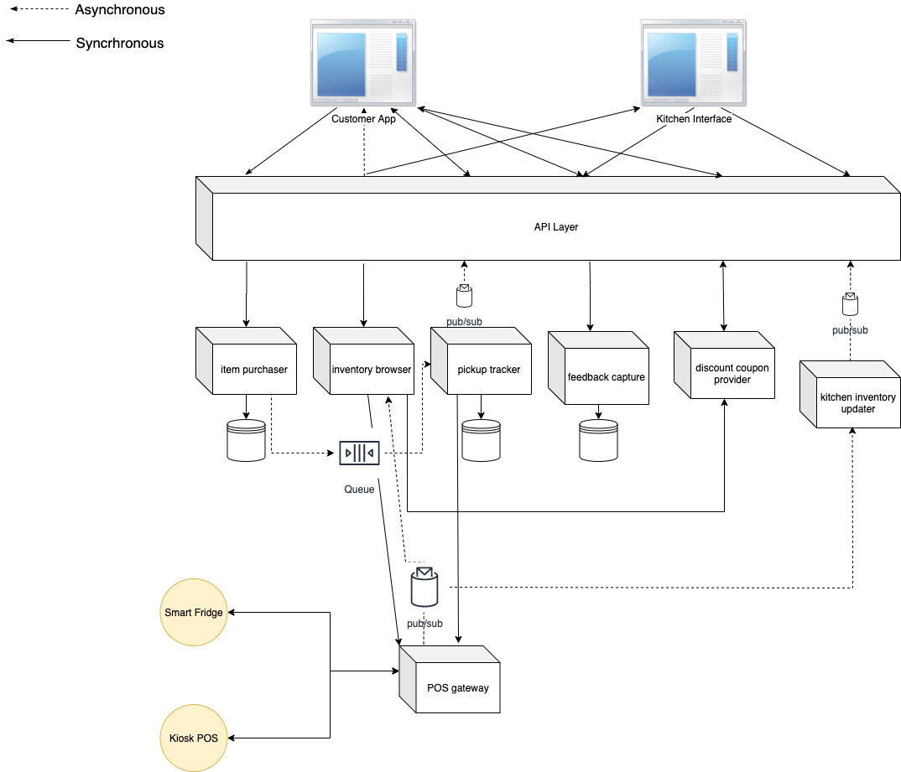

## Summary

This document describes the systems architecture of the Farmacy company. It is aimed to look at how best to understand the landscape of how these systems will be set up and how different actors will interact with the system. The architecture is built with scalability in mind and is designed to be extensible to new features

The core functioning model of Farmacy foods is essentially a logistics vehicle to connect your kitchens to your customers. The goal of this system is how to get meals to customers in an efficient manner. The inventory of the meals can be tracked

  
  

## Definitions

Before diving into the architecture it is important to have a unified language over the whole system as it will make diving deeper very easy to understand

**Kiosk:** is a sublet space inside another business where we will sell our product but have an employee to handle the transactions through a point of sale.

**Vendor kitchen:** a kitchen to whom we outsourced creation of meals for our inventory. These can be a kitchen we operate to make meals and later on when we scale the business model these will be different vendors providing their services to make meals to put on our platform

**Smart Fridge:** Smart fridge is one of the types of point of sales for our system. And can be accessible via an externally managed API.

**Point of sale(POS) :** One of the places where we sell our product. Currently it is either one of our smart fridge or at a kiosk.

**Customer:** A user that will buy a meal from farmacy foods either through the app or through stores

**Store Rep:** A representative at the kiosk that handles transaction of farmacy fresh meal sale through either of these two scenarios

 - By providing the meal to the user who has ordered the meal for the pick via the app and recording the transaction at the POS system
 - When a user buys a Farmacy fresh meal at the kiosk location and recording the transaction in the POS system

**Central Kitchen:** A network of all our vendor kitchen

  
  

## Assumptions:

 - Our kiosk POS and smart fridge APIs provides the ability to:
	 - notify us when an inventory is low for a specific fridge that we can
   subscribe to (e.g webhook)
   - reserve specific meals in the system so that it's available for users
   when they come to pick up. This is to avoid a scenario such as the
   following: if a fridge shows 1 mexican bowl salad, and a user
   purchases it via the app, this meal should be shown as unavailable in
   the fridge’s UI even though the meal is physically present. This
   prevents any other user from making that meal unavailable to the user
   who purchased it.
   
  - In order for a user to be able to purchase a farmacy fresh meal from
   a kiosk directly they need to provide their Farmacy food account info
   in order for the rep to record that transaction at the POS system
   
   - When a user purchases a meal via the app and they pick up at a kiosk
   location
	   - The user will need to provide a purchase receipt for the rep to
   validate that the item can be picked up by this person.
	   - The kiosk will reserve the meal at that location for the user to pick
   up.
   
   - When a user purchases a meal via the app and they pick it up at a
   smart fridge
	  - The user can use their card to access the fridge
      - The user can use a way to open the fridge via the app e.g a code
   provided to the user that they can enter

## System Design 

  
  

**Item Purchaser:** This component handles purchase transaction. Information such as when it was purchased and through which medium (fridge, kiosk) by the user is recorded. It submits a message to the queue for the Pickup tracker to process, if the message fails to be processed item purchaser reverts the purchase transaction

**Pickup Tracker:** This component consumes messages, from the queue, when an item has been purchased. It then notifies the fridge/POS that the item should be reserved for the user to pick up. In the event the POS/smart fridge API fails to register this request due to issues such as network unavailability, the pickup tracker will place the message into a dead letter queue.

**Inventory Browser:** This is responsible for providing a list of inventory available at our POS. It can manually request for inventory details through POS gateway. It also subscribes for events of activities happening at our POS. It also interacts with Discount Coupon provider service to find if there is a special pricing or coupon is available

**Feedback Capture:** This component captures feedback from clients on the items they have purchased.

**Discount Coupon Provider:** This component provides information on the discounts available on the meals and if a coupon applied by a user is applicable

**POS gateway:** This component interacts with our smart fridge and Kiosk POS API.

  

## Architecture Decision Record

### Title: Use of Micro Services Architecture

**Status:** Accepted

**Context:** The requirements indicated the need to allow mobile transaction, Integration with 3rd party APIs (Smart Fridge, POS)

**Decision:** We will use micro services to create a distributed architecture that allows us to easily scale components independently based on traffic, this allows for ease of scale to meet usage as the customer base grows over time.

This is also the preferred architecture for mobile applications based on REST, it will allow the ease of endpoint design to use the single responsibility model.

Consequences: The use of microservices architecture can present performance issues based on latency as a result of network distributed processes as opposed to in-process communication in a monolith application architecture.

However we believe that this can be mitigated with proper design of minimal payload exchange between inter-process component communication and micro service scaling.

  
  

### Title: Have two different components for Inventory Browser and Kitchen Inventory Updater

**Status:** Accepted

**Context:** It is conceivable that one should consider using a single component to handle both of these actions.

**Decision:** We decided to design them as separate components because one of the future goals of the company is to have multiple vendors. Using a separate component to handle the process of informing the kitchens or vendors of the various points of sale inventory levels lend itself to a pub-sub design model and more importantly the notification will more likely be event driven. At this time the requirement does not state what the event is. So we need to incorporate flexibility into the design to allow for any form of event trigger.

By isolating this to its own process we can easily configure the event around the component without worrying about the impact it could have on other related actions bundled with the same component.

Consequences: Additional components add more complexity to the design.

  
  

### Title: Use a queue to broker communication between Item Purchaser component and Pickup Tracker component

**Status:** Accepted

**Context:** When a customer makes a purchase on the mobile app, our design will add a pickup notification that will let the customer know that their purchase is ready for pickup or in case something goes wrong with the order process, the customer will also be notified.

**Decision:** We will use a queue and dead letter queue to handle sales-pickup integration. The Pickup Tracker component is responsible for sending the authorization to the specific fridge or Kiosk, so that the fridge or kiosk will allow the customer access to the item when they present the access code. However, if for whatever reason the fridge or kiosk cannot be reached (e.g. API is down) then we will need to notify the customer of the delay.

Using a queue allows for redundancy in case of unavailability of the points of sale API. In that case the transaction is not complete. By putting the message in a queue, it will not get lost, and can allow for eventual processing of the pickup notification to the point of sale (Fridge or Kiosk) by the Pickup Tracker process or component.

The alternative is to use a database instead of a queue but we will likely run into a scalability or elasticity issue in that case.

Consequence: The decision relies on the fact that the Fridge or Kiosk will be able to accept messages that can use used to validate a customer purchase when they attempt a pickup
